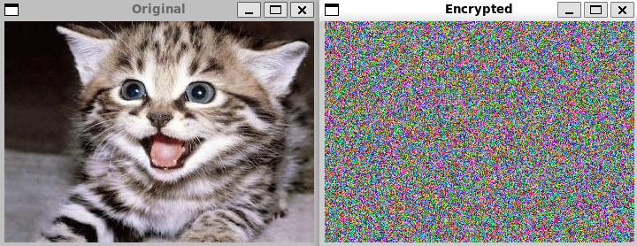

# Photo Encrypter 🖼️
Created by: Quang Tran



## Description 📝
This project focuses on the implementation of a Linear Feedback Shift Register
(LFSR for short). The program will generate random bits by simulating a LFSR and will be
used to create a simple encryption device for digital photos. In the latest version of this project, we
completed the full program with the help of the LFSR.

## Prerequisites ⚙️
- Ensure you have [SFML](https://www.sfml-dev.org/) installed on your system.

### Features ✨
This program features an implentation of a Linear Feedback Shift Register as previously 
mentioned. It takes in an image of the user's choice and encrypts it into a bunch of random
pixels. If the user inputs the encrypted image, it outputs the original image. How cool!

### Issues ❗
There are no known issues at the moment.

### Build 🛠️
Clone the repository:
   ```bash
   git clone https://github.com/quangt23/Photo-Encrypter.git
   cd Photo-Encrypter
   make
   ```
### Run 🚀
   ```bash
   ./Encrypt < input image > < output image > < 16 size bitstring >
   example:
   ./Encrypt input-file.png output-file.png 1011011000110110
   ```
